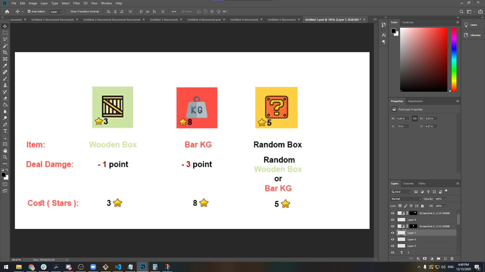
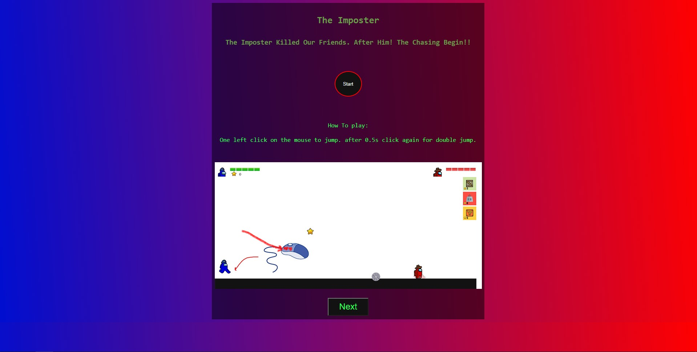
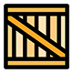

# Project1 - The Imposter 
## Description
The game about 2 of "Among us" characters. You chasing the imposter!    Catch him to make a win!!
Collect the stars to buy items by it. Damage the imposter decrease his health and catch him.

## WireFrame

[URL](https://wireframe.cc/pro/pp/2ff4eff31403383)

## Technologies Used
* HTML
* CSS
* JavaScript
* jQuery

## Project Stages
### Stage 1:

[Short video gameplay in stage 1](https://www.youtube.com/watch?v=H5VowUeeGxc)

### Stage 2:
Working on imges & Icon.

Landing Page after The project is done:

GamePlay The project is done:

### Items In The Game:
     

## Plan To Fix In Future
* Circular serrated to damage the target.
* Modify the UI to be better.

## References
- I Took the main idea of the animation from this youtube video. 
[URL](https://www.youtube.com/watch?v=3SsYZDJdeXk)

